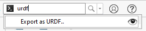

# 5. URDF 

<p style="text-align: justify;">
Un archivo URDF es un archivo xacro que describe un componente de un robot, ya sea su descripción puramente física, inercial, de controladores, etc. El que toma más tiempo siempre es el URDF general del robot porque describe toda la configuración y topología del mismo, para obtener este archivo se pueden tomar dos alternativas:<br><br>

1. Crear URDF con figuras básicas como cubos y cilindros, este método suele ser óptimo para robots sencillos como un servomotor. <br>
2. Extraer URDF de un software de modelación como _SolidWorks_, para esto se debe tener el ensamble total de la máquina/robot que se desea controlar, este método es óptimo para robots más complejos. <br><br>

En este caso se mostrarán brevemente los pasos que se llevaron en el canal de referencia para hacer el URDF del robot diferencial con figuras geométricas y un ejemplo en solidworks con un servomotor extraído de _Grabcad_.<br><br>
</p style="text-align: justify;">

## 5.1. Setup
<p style="text-align: justify;">
Para crear el archivo URDF, debe cumplir los siguientes pasos:
</p style="text-align: justify;">
1. Tener ROS2 instalado
2. Tener creado un workspace
3. Tener copiada la plantilla de Github
4. Instalar xacro:
`sudo apt install ros-humble-xacro`
5. Instalar joint state publisher:
`sudo apt install ros-humble-joint-state-publisher-gui`
<p style="text-align: justify;">
Los archivos de configuración de un robot se escriben en _xacro_, estos archivos son conocidos como archivos de descripción del robot, los documentos se procesan mediante _xacro_ obteniendo un solo archivo URDF que llega a un nodo llamado _robot state publisher_, este nodo convierte los archivos en un _/robotdescription_ y genera todas las transformaciones de las juntas (joints) mediante  _/tf_. Con esto, si deseamos mover las articulaciones del robot podemos utilizar _joint state publisher gui_ para visualizar el funcionamiento del robot.
</p style="text-align: justify;">

## 5.2. Ejemplo URDF con Robot diferencial

<p style="text-align: justify;">
Un robot diferencial es un robot que principalmente está formado por dos ruedas conocidas como _driven wheels_ (una en cada lado), estas dos ruedas son responables de _TODO_ el movimiento del robot; por lo que, todas las demás solamente son para _mantener estable_ el robot conocidas como _caster wheels_.
</p style="text-align: justify;">
<center>

</center>
<p style="text-align: justify;">
Con esta imagen se puede decir que el robot en realidad puede llegar a ser una _caja_ que tiene a sus lados un par de ruedas de dirección junto con otra rueda de estabilización. Para el comienzo del desarrollo del robot se plantean dos cosas:
</p style="text-align: justify;">

1. El enlace raíz (Root link) debe llamarse _base link_
2. La orientación de las uniones debe ser: +x delante, +y izquierda, +z arriba


### 5.2.1. Creando un archivo URDF

En la plantilla clonada anteriormente se tiene el siguiente archivo inicial de URDF:


```xml 
<?xml version="1.0"?>
<robot xmlns:xacro="http://www.ros.org/wiki/xacro" name="robot">

    <!-- Example link -->
    <link name="base_link">

```
<p style="text-align: justify;">
Con este URDF de esta manera al utilizar el comando `ros2 launch my_bot rsp.launch.py` se podrá visualizar el único link que tiene especificado el URDF. Lo que normalmente se hace es que en un archivo xacro se incluyen demás archivos xacro que contienen distinta información como el URDF, el controlador, componentes como cámara o dispositivos, etc. Por lo que este archivo base se puede modificar de la siguiente manera:
</p style="text-align: justify;">

```xml 
<?xml version="1.0"?>
<robot xmlns:xacro="http://www.ros.org/wiki/xacro"  name="robot">

    <xacro:include filename="robot_core.xacro" />
    
</robot>
```
<p style="text-align: justify;">
Este archivo estará llamando a `robot_core.xacro`, un xacro creado en la misma carpeta que contendrá el URDF del robot. Con esto ya se puede crear el archivo URDF del robot, primero se crean los materiales del robot de esta manera: 
</p style="text-align: justify;">

```xml 
    <material name="white">
        <color rgba="1 1 1 1" />
    </material>

    <material name="orange">
        <color rgba="1 0.3 0.1 1"/>
    </material>

    <material name="blue">
        <color rgba="0.2 0.2 1 1"/>
    </material>

    <material name="black">
        <color rgba="0 0 0 1"/>
    </material>
```
<p style="text-align: justify;">
Luego empieza _TODA_ la constitución del robot, esto quiere decir todos los _joints_ y _links_ que este mismo contiene comenzando por el _base link_ y _chassis_:
</p style="text-align: justify;">
```xml 
    <!-- BASE LINK -->

    <link name="base_link">

    </link>
```

Los _joints_ pueden ser de distintos tipos, tales como: _prismatic, revolute, fixed, continuous, etc_; además, se definen con un _parent_, _child_ y _origin_:


```xml 
    <!-- CHASSIS LINK -->

    <joint name="chassis_joint" type="fixed">
        <parent link="base_link"/>
        <child link="chassis"/>
        <origin xyz="-0.1 0 0"/>
    </joint>
```
<p style="text-align: justify;">
Luego de definir el joint se procede a definir el link del robot en el que primero se define el _visual_ como una caja de 300x300x150mm (todos los parámetros de ROS se encuentran siempre en sistema métrico internacional) con su respectivo origen y material previamente definido. Luego, se define la _collision_ , que basicamente es el mismo contenido del _visual_ sin el _material_; por último, se define su inercia, en este caso se está incluyendo otro archivo xacro en donde se define una macro llamada `inertial_box`, esta macro se define en otro archivo que se llamará `inertial_macros.xacro` y se incluirá de igual manera que se incluyó el `robot_core.xacro`
</p style="text-align: justify;">

```xml 
    <!-- ESTO IRÍA AL INICIO DEL CÓDIGO URDF -->

     <xacro:include filename="inertial_macros.xacro"/>
```
```xml 
    <!-- Archivo de inertial_macros -->

     <?xml version="1.0"?>
    <robot xmlns:xacro="http://www.ros.org/wiki/xacro" >

    <!-- Specify some standard inertial calculations https://en.wikipedia.org/wiki/List_of_moments_of_inertia -->
    <!-- These make use of xacro's mathematical functionality -->

    <xacro:macro name="inertial_sphere" params="mass radius *origin">
        <inertial>
            <xacro:insert_block name="origin"/>
            <mass value="${mass}" />
            <inertia ixx="${(2/5) * mass * (radius*radius)}" ixy="0.0" ixz="0.0"
                    iyy="${(2/5) * mass * (radius*radius)}" iyz="0.0"
                    izz="${(2/5) * mass * (radius*radius)}" />
        </inertial>
    </xacro:macro>  


    <xacro:macro name="inertial_box" params="mass x y z *origin">
        <inertial>
            <xacro:insert_block name="origin"/>
            <mass value="${mass}" />
            <inertia ixx="${(1/12) * mass * (y*y+z*z)}" ixy="0.0" ixz="0.0"
                    iyy="${(1/12) * mass * (x*x+z*z)}" iyz="0.0"
                    izz="${(1/12) * mass * (x*x+y*y)}" />
        </inertial>
    </xacro:macro>


    <xacro:macro name="inertial_cylinder" params="mass length radius *origin">
        <inertial>
            <xacro:insert_block name="origin"/>
            <mass value="${mass}" />
            <inertia ixx="${(1/12) * mass * (3*radius*radius + length*length)}" ixy="0.0" ixz="0.0"
                    iyy="${(1/12) * mass * (3*radius*radius + length*length)}" iyz="0.0"
                    izz="${(1/2) * mass * (radius*radius)}" />
        </inertial>
    </xacro:macro>


</robot>
```


```xml 
    <link name="chassis">
        <visual>
            <origin xyz="0.15 0 0.075"/>
            <geometry>
                <box size="0.3 0.3 0.15"/>
            </geometry>
            <material name="white"/>
        </visual>
        <collision>
            <origin xyz="0.15 0 0.075"/>
            <geometry>
                <box size="0.3 0.3 0.15"/>
            </geometry>
        </collision>
        <xacro:inertial_box mass="0.5" x="0.3" y="0.3" z="0.15">
            <origin xyz="0.15 0 0.075" rpy="0 0 0"/>
        </xacro:inertial_box>
    </link>
```
<p style="text-align: justify;">
De esta manera se sigue con las dos ruedas del robot, solamente que los joints serán de tipo _continuous_ y en vez de utilizar una geometría de _box_ se utilizará un _cylinder_ (además de definir origines e inercias). 
</p style="text-align: justify;">

```xml 
    <!-- LEFT WHEEL LINK -->

    <joint name="left_wheel_joint" type="continuous">
        <parent link="base_link"/>
        <child link="left_wheel"/>
        <origin xyz="0 0.175 0" rpy="-${pi/2} 0 0" />
        <axis xyz="0 0 1"/>
    </joint>

    <link name="left_wheel">
        <visual>
            <geometry>
                <cylinder radius="0.05" length="0.04"/>
            </geometry>
            <material name="blue"/>
        </visual>
        <collision>
            <geometry>
                <cylinder radius="0.05" length="0.04"/>
            </geometry>
        </collision>
        <xacro:inertial_cylinder mass="0.1" length="0.04" radius="0.05">
            <origin xyz="0 0 0" rpy="0 0 0"/>
        </xacro:inertial_cylinder>
    </link>

    <!-- RIGHT WHEEL LINK -->

    <joint name="right_wheel_joint" type="continuous">
        <parent link="base_link"/>
        <child link="right_wheel"/>
        <origin xyz="0 -0.175 0" rpy="${pi/2} 0 0" />
        <axis xyz="0 0 -1"/>
    </joint>

    <link name="right_wheel">
        <visual>
            <geometry>
                <cylinder radius="0.05" length="0.04"/>
            </geometry>
            <material name="blue"/>
        </visual>
        <collision>
            <geometry>
                <cylinder radius="0.05" length="0.04"/>
            </geometry>
        </collision>
        <xacro:inertial_cylinder mass="0.1" length="0.04" radius="0.05">
            <origin xyz="0 0 0" rpy="0 0 0"/>
        </xacro:inertial_cylinder>
    </link>
```

Luego de misma manera con la _caster wheel_ con un joint tipo _fixed_ y una geometría de _sphere_:

```xml 
    <!-- CASTER WHEEL LINK -->

    <joint name="caster_wheel_joint" type="fixed">
        <parent link="chassis"/>
        <child link="caster_wheel"/>
        <origin xyz="0.24 0 0"/>
    </joint>


    <link name="caster_wheel">
        <visual>
            <geometry>
                <sphere radius="0.05"/>
            </geometry>
            <material name="black"/>
        </visual>
        <collision>
            <geometry>
                <sphere radius="0.05"/>
            </geometry>
        </collision>
        <xacro:inertial_sphere mass="0.1" radius="0.05">
            <origin xyz="0 0 0" rpy="0 0 0"/>
        </xacro:inertial_sphere>
    </link>
    
    
</robot>
```


Con todo esto ya creado ya se podría _visualizar_ el robot sin ningún problema, solo haría falta compilar `colcon build --symlink-install` y `source install/setup.bash`. <br><br>

Después de esto al correr el comando `ros2 launch my_bot rsp.launch.py` y en una terminal nueva `ros2 run joint_state_publisher_gui joint_state_publisher_gui` se podría visualizar el robot y mover las ruedas según la definición del URDF. 


## 5.3. Ejemplo Servomotor URDF con Plugin de SolidWorks

<p style="text-align: justify;"> 
Un servomotor SG90 es un tipo de motor eléctrico que se utiliza para controlar la posición, velocidad y aceleración con precisión; este elemento al tener 1 DOF permite conocer e identificar los pasos a realizar para controlar el robot SCARA al tener una estructura muy similar.<br>
</p style="text-align: justify;"> 
<center>

</center>

Para realizar una simulación del elemento en movimiento se requiere de un URDF y si se tiene el elemento modelado, SolidWorks posee un plugin que brinda un archivo URDF. <br>

<center>

**PASOS**
</center>

1. Instalar sw2urdfSETUP.exe para la versión de SolidWorks que se tenga instalado. [Instalar plugin de SolidWorks](https://github.com/ros/solidworks_urdf_exporter/releases)

2. Abrir la pieza en SolidWorks.
3. En la parte superior derecha de la pantalla, se busca la extensión.
<center>

</center>

4. Se definen las barras o eslabones que presenta el elemento, en este caso, se fja la base como la barra de tierra (inmovil), y se definen los eslabones y pares cinemáticos como las partes moviles.
<center>

</center>

5. Se presiona la opción de "Preview and export URDF" y se definen las variablees que posee el elemento, luego se genera el URDF y las mallas del elemento.
<center>

</center>

** EJEMPLO DEL URDF EXPORTADO**


        <?xml version="1.0"?>

        <robot
        name="servo7">
        <link
            name="base">
            <inertial>
            <origin
                xyz="-6.7573E-06 0.011598 5.6311E-08"
                rpy="6 0 0" />
            <mass
                value="0.0064019" />
            <inertia
                ixx="3.4577E-07"
                ixy="-2.7463E-10"
                ixz="4.3013E-12"
                iyy="3.8183E-07"
                iyz="2.2886E-12"
                izz="5.7895E-07" />
            </inertial>
            <visual>
            <origin
                xyz="0 0 0"
                rpy="0 0 0" />
            <geometry>
                <mesh
                filename="package://modelo_servo/meshes/base.STL" />
            </geometry>
            <material
                name="acrylic">
                <color
                rgba="0.0 0.0 1.0 1.0" />
            </material>
            </visual>
            <collision>
            <origin
                xyz="0 0 0"
                rpy="0 0 0" />
            <geometry>
                <mesh
                filename="package://modelo_servo/meshes/base.STL" />
            </geometry>
            </collision>
        </link>
        <link
            name="plu_chasis">
            <inertial>
            <origin
                xyz="0.001818 -5.3648E-05 -0.0015"
                rpy="0 0 0" />
            <mass
                value="0.00035175" />
            <inertia
                ixx="3.232E-09"
                ixy="1.5994E-25"
                ixz="1.252E-25"
                iyy="7.3777E-09"
                iyz="-1.8232E-25"
                izz="1.0082E-08" />
            </inertial>
            <visual>
            <origin
                xyz="0 0 0"
                rpy="0 0 0" />
            <geometry>
                <mesh
                filename="package://modelo_servo/meshes/plu_chasis.STL" />
            </geometry>
            <material
                name="">
                <color
                rgba="0.0 0.0 1.0 1.0" />
            </material>
            </visual>
            <collision>
            <origin
                xyz="0 0 0"
                rpy="0 0 0" />
            <geometry>
                <mesh
                filename="package://modelo_servo/meshes/plu_chasis.STL" />
            </geometry>
            </collision>
        </link>
        <joint
            name="joint1"
            type="fixed">
            <origin
            xyz="-0.00409 0.0227 0"
            rpy="1.5708 -0.007929 0" />
            <parent
            link="base" />
            <child
            link="plu_chasis" />
            <axis
            xyz="0 0 0" />
        </joint>
        <link
            name="eje">
            <inertial>
            <origin
                xyz="6.3741E-05 0.0031 4.638E-05"
                rpy="0 0 0" />
            <mass
                value="0.00010538" />
            <inertia
                ixx="6.1365E-10"
                ixy="-1.9311E-27"
                ixz="-2.6707E-26"
                iyy="3.168E-10"
                iyz="-1.2874E-27"
                izz="6.1365E-10" />
            </inertial>
            <visual>
            <origin
                xyz="0 0 0"
                rpy="0 0 0" />
            <geometry>
                <mesh
                filename="package://modelo_servo/meshes/eje.STL" />
            </geometry>
            <material
                name="acrylic">
                <color
                rgba="0.5 0.5 0.5 1.0" />
            </material>
            </visual>
            <collision>
            <origin
                xyz="0 0 0"
                rpy="0 0 0" />
            <geometry>
                <mesh
                filename="package://modelo_servo/meshes/eje.STL" />
            </geometry>
            </collision>
        </link>
        <joint
            name="joint2"
            type="continuous">
            <origin
            xyz="-0.00415 0.0232 -0.0001"
            rpy="0 0 0" />
            <parent
            link="base" />
            <child
            link="eje" />
            <axis
            xyz="0 1 0" />
            <dynamics
            friction="0.1" />
        </joint>
        <link
            name="plumilla">
            <inertial>
            <origin
                xyz="0.0042098 5.9689E-05 -0.0021514"
                rpy="0 0 0" />
            <mass
                value="0.00011261" />
            <inertia
                ixx="4.3387E-10"
                ixy="-6.7617E-11"
                ixz="2.3634E-10"
                iyy="2.941E-09"
                iyz="6.3694E-12"
                izz="3.2007E-09" />
            </inertial>
            <visual>
            <origin
                xyz="0 0 0"
                rpy="0 0 0" />
            <geometry>
                <mesh
                filename="package://modelo_servo/meshes/plumilla.STL" />
            </geometry>
            <material
                name="acrylic">
                <color
                rgba="1.0 0.41 0.71 1.0" />
            </material>
            </visual>
            <collision>
            <origin
                xyz="0 0 0"
                rpy="0 0 0" />
            <geometry>
                <mesh
                filename="package://modelo_servo/meshes/plumilla.STL" />
            </geometry>
            </collision>
        </link>
        <joint
            name="joint3"
            type="fixed">
            <origin
            xyz="6E-05 0.0034 0.0001"
            rpy="1.5708 -0.054172 0" />
            <parent
            link="eje" />
            <child
            link="plumilla" />
            <axis
            xyz="0 0 0" />
        </joint>

        

        </robot>


        
