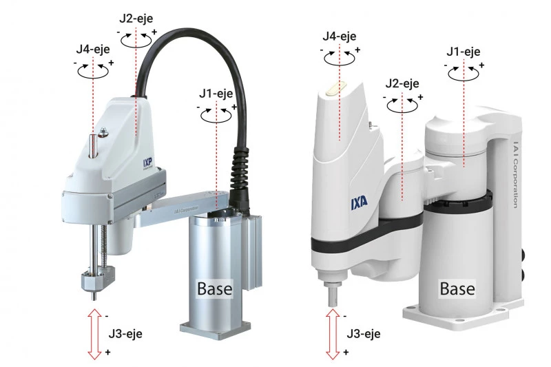

# 6. Scara 

Según el ejemplo realizado en Solidworks con el servo, se procedió a realizar lo mismo pero con la modelación del robot SCARA que se tiene a disposición

Los robots Scara, conocidos comúnmente como brazos robóticos, son un éxito de la automatización. Sus cuatro grados de libertad proporcionan mucha más velocidad, precisión y opciones que los manipuladores cartesianos estándar de tres ejes utilizados para la manipulación.   

SCARA son las siglas de "Selective Compilant Assembly Robot Arm" (brazo robótico de ensamblaje selectivo). Se trata de un pequeño robot destinado a realizar tareas repetitivas con rapidez y precisión. Una de sus aplicaciones más comunes es "recoger y colocar" piezas del punto A a la posición B.

Para esto se tiene la siguiente modelación del SCARA:

IMAGEN DEL SCARA MODELADO

